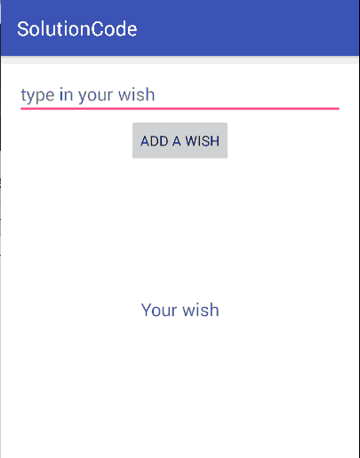

#  Simple Animation Lab

## Introduction

> ***Note:*** _This can should done independently._

In this lab, you will be building an animated wish list using your knowledge of view and layout animation. The app should have an edit text where a user
can type in his/her wish. After clicking the button "add a wish", the wish should get animated and then be added to the wish list on top
of other wishes. The app does not have to look the same, but it needs to have the same functionality.  

**Hint**: when adding a new text view to the list make sure to specify the position 0.

## Exercise

#### Requirements

- contain an edit text (to type in a wish), button (to add a wish), text view (the place where the wish will get animated) and a
view group (wish list)
- edit text should be no more than one line
- text view should get animated (use *alpha* and *rotate* types of animation)
- a new wish should be added to the top of the list
- input field should get cleared after a wish is added to the list

**Bonus:**
- add functionality to remove a wish from the list

#### Starter code

Take a look at the [starter-code](starter-code). The only class to work with is **MainActivity**. Add the views and take care of an event listener on the button. In the project, you can find a folder `anim/` with one file **animation.xml** for you to take care of the animation set. In the file **activity_main.xml** add
the views. Do not forget about a view group where you will store all the wishes.

You have a choice of coding layout animation in the xml file or in java class.

#### Deliverable

Here is a gif that shows view and layout animation:

  

